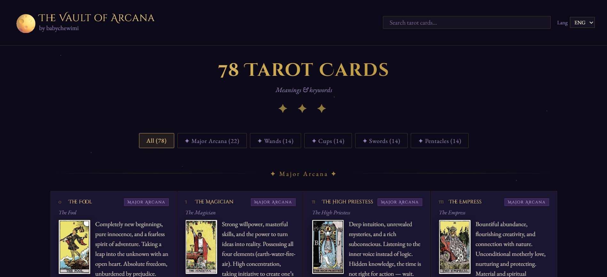

# 🔮 Arcana Vault

A minimalist static website that provides quick, beginner-friendly meanings for Tarot cards. Designed for fast browsing — no clicks, no navigation, just scroll and learn.

## Demo
- https://trucanhgh.github.io/arcana-vault/
- https://chewimi-tarot.netlify.app/

## Preview


## ✨ Features
- Instant meanings — all cards on a single page
- Click on a card to reveal its reversed meaning
- Clean, aesthetic UI with smooth hover effects
- Responsive design (works on mobile)
- Bilingual support (English & Vietnamese)

## Tech
- HTML
- CSS
- JavaScript

## Setup
```bash
git clone https://github.com/trucanhgh/arcana-vault.git
cd arcana-vault
